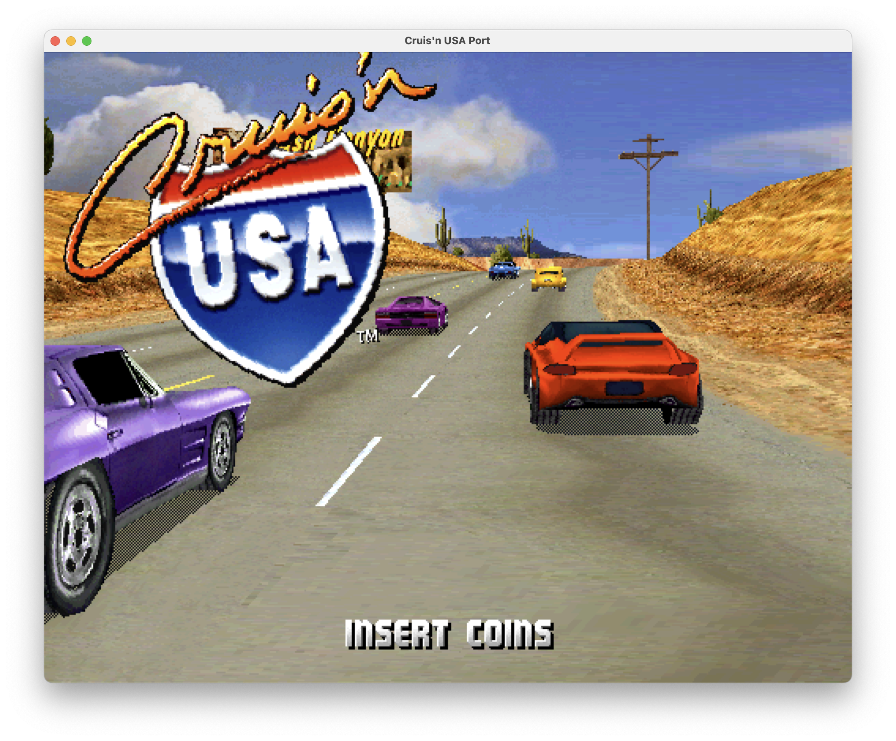

# Cruis'n USA

A work-in-progress port of the original *Cruis'n USA* arcade game from
TMS320C30 assembly to portable C using SDL2.

The goal is **100% functional equivalence with the version 4.5 arcade ROM** on
modern systems.

<p align="center">
  
</p>

## Status

The port currently reaches the attract sequence shown above. It is under active
development and is not yet fully playable.

## Background

The original assembly source was published by
[Historical Source](https://github.com/historicalsource/cruisin-usa) and is
preserved in [`asm/`](asm/). That source is **version 4.4**, while this project
targets the later **version 4.5** retail ROM.

To recover the changes made between those versions, this project uses a
[source ↔ ROM disassembly walker](tools/ida/walk_source_and_rom.py). It aligns
the 4.4 source with the disassembled 4.5 program, allowing the code and data
that actually shipped to be identified and restored.

The original archive also omitted most game assets and their final IDs and
memory locations. The walker recovers these from matched instructions. For
example:

```asm
LDA @red_car, AR1
```

Once this source instruction is aligned with the ROM, its compiled operand
reveals the value of `@red_car`. The same process recovers asset IDs, function
addresses, memory locations, and other missing constants.

## Translation and validation

AI is used to translate the game function by function, keeping the original
assembly beside the generated C for review and debugging.

Correctness is checked against the version 4.5 game running in **MAME**.
Validation markers capture function entries, registers, and memory from MAME;
the port then replays the same sequence and stops at the first difference. See
the [translation guide](docs/function-translation.md) and
[debugging guide](docs/debugging.md) for details.

## Building

Dependencies:

- CMake 3.20+
- SDL2
- A C11 compiler
- Python 3

```sh
cmake -S . -B build
cmake --build build
```

To check translated C3x floating-point operations:

```sh
cmake --build build --target check-c3x-translation
```

## Running

This project does not include arcade ROMs or missing game assets. Supply a
legally obtained version 4.5 main-data image at:

```text
roms/crusnusa45_maindata_interleaved.bin
```

Run the game from the repository root. Unless you have generated a MAME
validation capture, disable validation replay:

```sh
CRUSN_DISABLE_MAME_VALIDATION=1 ./build/crusn --free-play
```

Press <kbd>Return</kbd> for Start.

## Contributing

Correctness takes priority over cleanup. Keep translations close to the
original assembly and validate behavior against MAME wherever practical. Start
with the [function translation guide](docs/function-translation.md); coroutine
style `PROC` routines also have a [dedicated guide](docs/proc-translation.md).

## Legal

*Cruis'n USA* and its original code and assets belong to their respective
rights holders. This is an independent preservation and compatibility project
and is not affiliated with or endorsed by the original developers or
publishers. No commercial ROM data is included.
